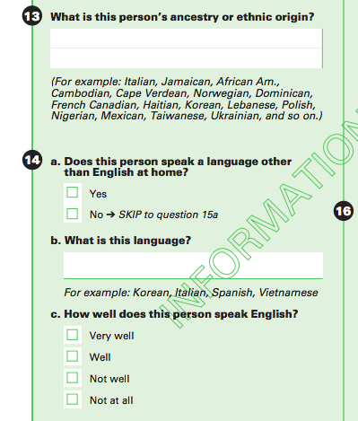
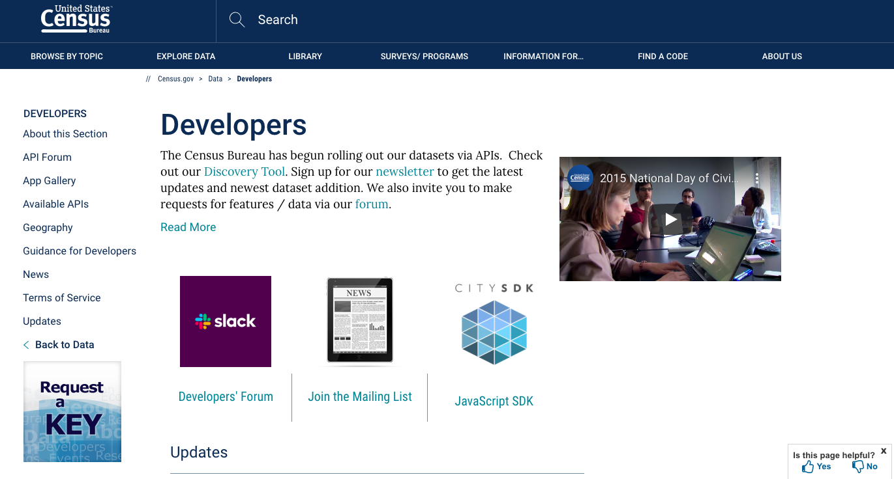

```{r setup, include=FALSE}
knitr::opts_chunk$set(echo = TRUE)
# options(tigris_use_cache = TRUE)
options(width = 100)
```

```{r libraries, include=FALSE}
library(tmap)
library(sf)
library(tidycensus)
library(tidyverse)
library(shiny)
library(shinythemes)
library(shinydashboard)
library(knitr)
library(leaflet)

# Set directory 
# setwd("~/")


# For if-else fork for API key
# api_nokey_value = TRUE
# api_key_value = FALSE

```

```{css, echo=FALSE}
p {
  font-size: 15px;
}
```


## Language data from the US Census

This script illustrates one method of accessing US Census data using [R](https://www.r-project.org/) with [R Markdown](https://rmarkdown.rstudio.com/). It is not a comprehensive guide and will not provide step-by-step examples. It's purpose is to provide a broad overview of tools and major functions that can be used through a sample illustration. Although no R programming experience is required, the R code is provided and can be modified directly in the script. 

### Goals of the demo

1. Provide a high-level overview of key functions in [tidycensus](https://walker-data.com/tidycensus/), an R package that collects data from servers at the US Census; 
1. Show how labels in the data can be filtered and modified for later scripting;
1. Work through design choices in how the data are presented visually; 
1. Provided an advanced, worked example of an interactive [tmap](https://github.com/mtennekes/tmap) in an embedded [shiny app](https://shiny.rstudio.com/). 

Don't worry if not all of these terms are familiar yet; they should become clearer by reading the description of the script below. Just a warning: running the script in R or R Studio can take a very long time!


### US Census

Every 10 years, the US Census Bureau conducts a survey of every American household. Survery [questions](https://2020census.gov/en/about-questions.html) include the number of people occupying your home or apartment, your gender identity, your age, and your self-identified race. 

The USCB also conducts another survey, the American Community Survey, monthly each year and is sent to a sample of addresses. Survey [questions](https://www.census.gov/programs-surveys/acs/methodology/questionnaire-archive.html) include those not posed in the decenniel census, such as education, transportation, and - crucially - what language besides English is spoken in the home and the proficiency of the speaker: 





Though we might have qualms about the precise methodology , this is an *amazing* resource for estimating language diversity in the United States. Better yet, it's *free* and *publicly available* to anyone who wants to explore the data.

While we could navigate to the main page and use the web interface provides, the USCB has provided an *Application Programming Interface* (API) that allows applications like your computer or cell phone to communicate with one another. 





We'll be using a very handy R package called [tidycensus](https://walker-data.com/tidycensus/) to handle the API call. In general, the packages you'd need to run this script are: 

- tmap
- sf
- tidycensus
- tidyverse
- shiny
- shinythemes
- shinydashboard
- knitr
- leaflet

Packages are collections of code and datasets that are often provided and maintained by a third party. They can be loaded from a server using *install.packages("package_name")* and loaded into the R script with *library(package_name)*, where *package_name* corresponds to the name of a package like "tmap" or "sf". Installing packages is beyond the scope of his demonstration, but detailed instructions can be found online - for example, [here](https://www.datacamp.com/community/tutorials/r-packages-guide).


After downloading and loading the required packages, the first step is to get an API key to access the US Census data [https://api.census.gov/data/key_signup.html](https://api.census.gov/data/key_signup.html). An alphanumeric string will be sent to the email you provide. Once received, replace 'NULL' with your personalized key `r api_key = "NULL"`. This is the only time you'd need to modify the code in this script. Note: If you do not provide an API key, the script will use "df_lang12_data.shp" file instead. The results will be the same for this demo. If you wanted to look at another variable or a different dataset, however, you'd need to acquire an API key to query the server.

The API key will be used in the *census_api_key()* function in the *tidycensus* package to connect to the US Census server. It is formatted to integrate with the [tidyverse](https://www.tidyverse.org/) package, designed for data science, and may optionally provide [spatial features](https://desktop.arcgis.com/en/arcmap/10.3/manage-data/geodatabases/an-overview-of-spatial-references.htm) (sf) coordinates for mapping geographic data. These coordinates are used with [tmap](https://github.com/mtennekes/tmap), a highly versatile package for plotting thematic maps with a *ggplot* syntax.

Again, this is a lot of information! If you're new to R, APIs, or even programming in general, this should be enough to get a basic gist of one kind of project that can be conducted using these tools.


```{r, api_key_validation, echo = FALSE}

# If no API key is provided

if (api_key == "NULL") {
  api_nokey_value = TRUE
  api_key_value = FALSE
} else {
  api_nokey_value = FALSE
  api_key_value = TRUE
  census_api_key(api_key)
}

```
<br><br>


## Accessing data with tidycensus 

Multiple datasets from the US Census can be accessed with *tidycensus* using the *get_decennial()* and *get_acs()* functions, as mentioned in the basic usage vignette:

  > There are two major functions implemented in tidycensus: get_decennial(), which grants  access to the 2000 and 2010 decennial US Census APIs, and get_acs(), which grants access to the 1-year and 5-year American Community Survey APIs. 


We'll be using the American Community Survey (acs5) from 2012 for illustration. A dizzying array of variables are provided within the dataset: 1,000 unique categories and over 20,000 subcategores. The variables can be loaded and viewed with the *load_variables()* function with the "year" and "dataset" arguments specified as follows:


    load_variables(year = 2012, dataset = "acs5")

<br>

```{r, echo = FALSE, include = FALSE, eval = api_nokey_value}
# Use if no API key provided

setwd('/Users/jesse/Box/DataScience/MapProjectGit/')

# Create list of variables for 2012
df_lang12 <-
  readRDS("Data/df_lang12_percent")
  
  
# st_read(dsn = "www/df_lang12_data.shp")

# st_write(df_lang12, "Data/df_lang12_data.shp", package = "sf")

# Note: Code chunks with "eval = api_nokey_value" will not be run if no API key is provided.


# st_write(df_lang12, "Data/df_lang12_data.shp", package = "sf")

# Note: Code chunks with "eval = api_nokey_value" will not be run if no API key is provided.

```


```{r, echo = FALSE, eval = api_key_value}
# Use if API key provided

# Create list of variables for 2012
acs5_12 <-  
  load_variables(year = 2012, 
                 dataset = "acs5"
  )

# Use to write acs5 data to file:
# st_write(acs5_12, "Data/acs5_12_data.shp", driver = "ESRI Shapefile")

# Use to look at the dataset:
# View(acs5_12)

```


For the present, we're just interested in variables associated with language. Using the *View()* function, we can explore the variables and their associated codes. If you ran *View(acs5_12)*, you'd see that the categories are organized hierarchically, starting with *B16001* and followed by a three digit tag "_NUM"" referring to subcategories.

Fortunately, these codes do not have to specified by hand. We can use the *filter* and *mutate* functions to select just the labels we're interested in. 
<br>

    acs5_12_lang_vars <-  
       acs5_12 %>%
       filter(grepl("B16001", name)) %>%
       filter(!grepl("very well", label)) %>%
       filter(!grepl("less than", label)) %>%
       mutate(label = case_when(
              label == "Estimate!!Total" ~ "Total",
              TRUE ~ gsub("Estimate!!Total!!", "", label)
       )
    )

 
<br><br>


```{r get_varlist_2012, echo = FALSE, eval = api_key_value}

# Create list of variables for 2012
acs5_12_lang <-  
#   load_variables(year = 2012, dataset = "acs5") %>%
  acs5_12 %>%
  filter(grepl("B16001", name)) %>%
  filter(!grepl("very well", label)) %>%
  filter(!grepl("less than", label)) %>%
  mutate(label = case_when(
    label == "Estimate!!Total" ~ "Total",
    TRUE ~ gsub("Estimate!!Total!!", "", label)
  )
  ) %>%
  select(label, name, -concept)


# Create character frame from tibble  
acs5_12_lang_vars <- deframe(acs5_12_lang)

```


These variables can be transformed into a list using *deframe()* for use in the *get_acs()* function. We will use pass the variables with the language categories ("acs5_12_lang_vars"), along with the following variable specifications: 

    get_acs(
       geography = "county", 
       variables = acs5_12_lang_vars, 
       year = 2012,
       geometry = TRUE, 
       state = "California"
       )
  

For simplicity, we've limited our search to counties in California, but could access any and all of the 50 United States, District of Columbia, and Puerto Rico.


```{r get_data, echo = FALSE, eval = api_key_value}

df_lang12 <-
  get_acs(
    geography = "county", 
    variables = acs5_12_lang_vars, 
    year = 2012,
    geometry = TRUE, # Needed for tmap
    state = "California"
  ) %>%
  rename('pop_2012' = estimate) %>%
  select(-moe)


```


After some mild clean up, we get the following dataframe: 

```{r}

head(df_lang12)

```

<br><br>

A quick description of the variables above:


| Column name | Description                                                  |
|-------------|--------------------------------------------------------------|
| GEOID       | A label for the census tract                                 |
| NAME        | The county in the survey                                     |
| variable    | Langauge group, including the total population of the county |
| pop_2012    | The estimated number of speakers in the language group       |
| geometry    | Coordinates for the county in a Multipolygon format          |


<br>


Rows with the value "Total" in the "county_total" column correspond to the total number of respondents per county. We'll use that information to first determine how many respondents indicated another language in their survey. We'll then calculate for each language entered into the survey, the percentage that the language was provided. An explanation of the R code that implements this goes beyond what we can discuss here, but is provided in the code boxes below. 


```{r merging, message = FALSE, warning = FALSE }

df_lang12_tot <- df_lang12 %>%
  filter(variable == 'Total')  %>%
  rename('county_total' = pop_2012) %>% 
  select(-variable, -GEOID, -NAME)
# df_lang12_tot


# Get English only data
df_lang12_eng_only <- df_lang12 %>%
  filter(grepl('English', variable))

# Join data to create totals for non-English responses by county
df_lang12_for_not_eng_total <- st_join(df_lang12_eng_only, df_lang12_tot, join = st_contains) %>%
  mutate(county_total_not_eng = county_total-pop_2012) %>%
  select(county_total_not_eng)

# df_lang12_for_not_eng_total

# Get data for non-English languages
df_lang12_notot <- df_lang12 %>%
  filter(variable != 'Total') %>%
  filter(!grepl('English', variable))

# not engs
df_lang12_remerge <- st_join(df_lang12_notot, df_lang12_for_not_eng_total, join = st_contains) 
  

```


```{r add_percent, message = FALSE, warning = FALSE}

# Add percent
df_lang12_percent <- df_lang12_remerge %>%
  mutate(Percent = round(100*(1-(county_total_not_eng - pop_2012)/county_total_not_eng), 2))

```

After some additional data manipulation, we're finally ready to see a map of languages spoken in California! As a first attempt, we might try to show each state individually in a facet window:


```{r map_all, fig.align = 'center', message = FALSE, warning = FALSE}

# Mapping

# Optional: Set style here
# current_style <- tmap_style("white")
# tmap style set to "col_blind"

map_all <- df_lang12_percent %>%
  tm_shape() +
  tm_polygons(col = "Percent", 
              style = "kmeans",
              legend.hist = TRUE) + 
  tm_facets("variable") + 
  tm_layout(legend.outside = TRUE) 
  
map_all

```

<br><br>

However, this is very hard to read. Spanish is so heavily represented that it's difficult to see any variation among other languages. Just limiting ourselves to Spanish, Tagalog, and Hungarian illustrates the point. The mean, minimum, and maximum percent of these languages across counties is shown in the table and plotted below:

<br>

```{r table, message = FALSE, warning = FALSE}

sample_table <- df_lang12_percent %>%
  filter(grepl("Spanish|Tagalog|Hungarian$", variable)) %>%
  # summarize(range = range(Percent)) %>%
  group_by(variable) %>%
  summarize(mean = mean(Percent), 
            minimum = min(Percent),
            maximum = max(Percent)) %>%
  ungroup() %>%
  select(variable, mean, minimum, maximum) %>%
  st_set_geometry(NULL)

knitr::kable(sample_table, digits = 2)

```

Even though Tagalog is spoken by a relatively large percent (between 3.5 and 23%) of people, it is nevertheless clustered with languages  with far fewer speakers, such as Hungarian, which is spoken by at most 1% of people in this sample.


```{r map_selected, fig.align = 'center', message = FALSE, warning = FALSE}


# Mapping

# Optional: Set style here
# current_style <- tmap_style("white")
# tmap style set to "col_blind"

map_select <- df_lang12_percent %>%
  filter(grepl("Spanish|Tagalog|Hungarian$", variable)) %>%
  # filter(grepl("Thai|Laotian|Vietnamese", variable)) %>%
  tm_shape() +
    tm_polygons(col = "Percent", 
              style = "kmeans",
              legend.hist = TRUE) + 
  tm_facets("variable") + 
  tm_layout(legend.outside = TRUE) 
  
map_select

```

The issue is that the colors in the map are determined by how the thresholds between categories defining the colors are established. The frequency of Spanish skews the results, blurring differences between clusters. Although this skew is informative, in that it reveals the prevalance of Spanish in California, it obscures how other languages are distributed across the state. Next, we'll plot each language individually, so that the differences between language frequency won't skew the visualizations.


## Embedding map into shiny app


Visualization of the map becomes easier once we add some user controls. We'll embed the map into a [shiny app](https://shiny.rstudio.com/) for this purpose. Rather than going through the code, let's just take a look at the features. We have an interactive map that we can use to visualize how different languages are represented across counties in California. If no language data is provided, the map won't render. 

We've also added options for exploring different [clustering methods](https://geocompr.github.io/post/2019/tmap-color-scales/). Try get a feel for how different methods divide up the color scales. 


- equal: Values are put into equal bins. This method is best used for uniform distributions, and may be inappropriate in the case of skew. 
- k-means: Values are clustered using the k-means method by minimizing the sum of squares distance from a center point. 
- hclust: Values are clustered by calculating the set of dissimilarities of points. Points initially form their own cluster and are then joined by the most similar cluster, iterated until the best fit is found. 
- jenks: Forms groups by clustering similar values while maximizing differnces between clusters.


```{r, shiny_app, fig.align = 'center', message = FALSE, warning = FALSE}

shinyApp(
# Define UI for application that draws map
ui <- fluidPage(
   
    # Add theme
    theme = shinytheme("yeti"), 
    
    # Add css styling
     tags$head(tags$style(
    HTML('
         #sidebar {
            background-color: #dec4de;
        }

        body, label, input, button, select { 
          font-family: "Arial";
        }')
  )),
    
   # Application title
   titlePanel("Language Diversity in California"),
   # headerPanel("US Census Data, 2012"),
  
  # Header information
  # h1("Language Diversity in California"),
  # h3("2012 US Census Data"),
  # "Jesse Harris",
  # br(),
  # paste("File hosted at", app_link),
  # br(),
  
   # Sidebar with a slider input for number of bins 
   sidebarLayout(
      sidebarPanel(
       #  tmapOutput("map"),
        
        # Languages to display 
          selectInput(
          inputId = "lang_input",
          label = "Languages to display ",
          unique(as.character(df_lang12_percent$variable))
        ), # selectInput end        

        # Clustering
        selectInput(
          inputId = "cluster_input",
          label = "Clustering method",
          choices = c(
            # "default" = "",
            "equal" = "equal",
            # "std dev" = "sd",
            # "fisher" = "fisher",
            # "bagged" = "bclust",
            "k-means" = "kmeans",
            "hierarchical" = "hclust",
            # "quantile" = "quantile",
            "jenks" = "jenks"
           ) # choices end
        ) # selectInput end        
       ) # sidebarPanel end
      , # second argument in sidebarLayout
      
      # Show a plot of the generated distribution
      mainPanel(
         # plotOutput("langPlot", height = 500)
         tmapOutput("langPlot", width = "100%", height = 450)
      ) # mainPanel end
    ) # sidebarLayout end
 ) # fluidPage end

    , # introduce second argument

# Define server logic required to draw a histogram
server <- function(input, output) {
  output$langPlot <- # renderPlot({
        renderTmap({
    # Set style here
    # current_style <- tmap_style("white")
    ## tmap style set to "col_blind"
    
    tmap_mode("view")

    df_lang12_percent %>%
      filter(grepl(paste0(input$lang_input, "$"), variable)) %>%
      tm_shape() +
      tm_polygons(col = "Percent", 
                  id = "NAME",
                  style = input$cluster_input,
                  legend.hist = TRUE) + 
      tm_facets("variable") + 
      tm_layout("Percent thresholds", 
                legend.outside = TRUE,
                legend.title.size = 1.2,
                legend.text.size = 0.8
               ) 
    
    
   })
}

# Run the application 
# shinyApp(ui = ui, server = server)


)


```


The plot area is also interactive! Hovering over the country reveals its name. You can even change the background overlay to include the names of neaby states and their topological features. 


# Conclusion

This is just a taste of what we can accomplish in R. Althoguh the learning curve can be steep, it's an incredibly powerful and dynamic tool for accessing, manipulating, and presenting data. I hope this short tutorial will inspire newcomers to take a closer look at the language. A few additional resources to get you started are provided below: 

1. [Introduction to R](https://learn.datacamp.com/courses/free-introduction-to-r). A free video series from [DataCamp](https://learn.datacamp.com/). 
1. [Introduction to R Seminar](https://stats.idre.ucla.edu/r/seminars/intro/). An interactive course with coding exercises by [IDRE](https://stats.idre.ucla.edu/) at [UCLA](https://www.ucla.edu/).
1. [R for Data Science](https://r4ds.had.co.nz/). Although more advanced than the others, this amazing resource provides a complete overview of the *tidyverse* infrastructure. Highly recommended!

Happy R-ing!

<br>
<br>
<br>
